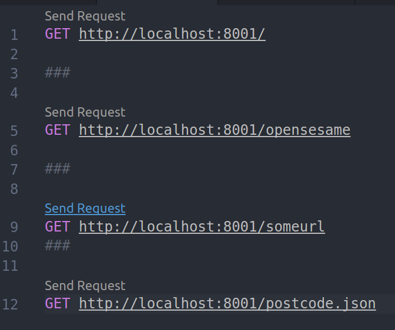
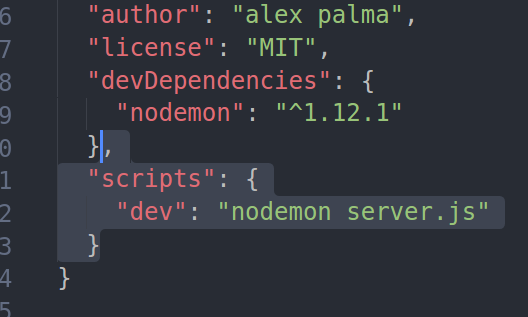

## prereqs
installed the REST Client by Huachao Mao for VSCode

The way you then use that is if you have a file such as http.REST or test.http (extension doesn't matter) and in there you have some lines such as:
`GET http://www.google.com`
what the extension does is add just above that a clickable link that will then make the request for you and display all the raw data that was returned by the server:



## steps 
after creating this code and verifying it works by visiting it in a browser and seeing it output in the terminal 'request recieved' ran the yarn init command

```javascript
const HTTP = require('http');

const server = HTTP.createServer((request, response) => {
  console.log("request received");
});

//start the server:

server.listen(8001, (error) => {
  console.log('Server has started at http://localhost:8001');
});

```

`yarn init`

then ran `yarn add nodemon --dev` to detect file changes and ??

(then in future when you run your app run it with `node_modules/.bin/nodemon server.js`)


it creates (or edits?) a package.json file for us and that is like our gemfile from rails apps.

the yarn.lock file is like the gemfile.lock version for the point of consistency between computers (if someone git clones our project it ensures everyone is running the same version)

it installs the packages in the node_modules folder. Each project therefore has its own version of those packages, unlike Rails/Ruby where the packages were shared among all the projects and if you wanted to use something different you would have had to specify that to bundler...

in order to save ourselves some time instead of typing out ./node_modules/.bin/nodemon ourfile.js each time we can make the following highlighted change to our package.json file:



you can then run it with `yarn dev`

then if you add the line `response.end("back at you");` to within the HTTP.createServer block and save it you will notice that the terminal shows activity of restarting the server because a file was changed.

modify the code to log the path the user attempted to visit:
```javascript
  let path = request.url;
  console.log("request received", path);
```

here is the server block now with an example of simple routing:
```javascript
const server = HTTP.createServer((request, response) => {
  let path = request.url;
  console.log("request received", path);
  if (path === '/'){
    response.end("home");
  }
  else if (path === '/opensesame'){
    response.end("ooh you found the easter egg!");
  }
  else {
    response.end('back at you');
  }

});
```

When we make a REST http file with some GET lines in it and use the REST Client extension to test the servers responses and inspect them we see that it doesn't mention mimetype so we can fix that by adding the following line to our http server codeblock:
```javascript
  else if (path === '/postcode.json'){
    response.writeHead(200, {
      'Content-Type': 'application/json'
    });
    response.end(`{"name": "Melbourne", "postcode": "3000"}`);
  }
```


